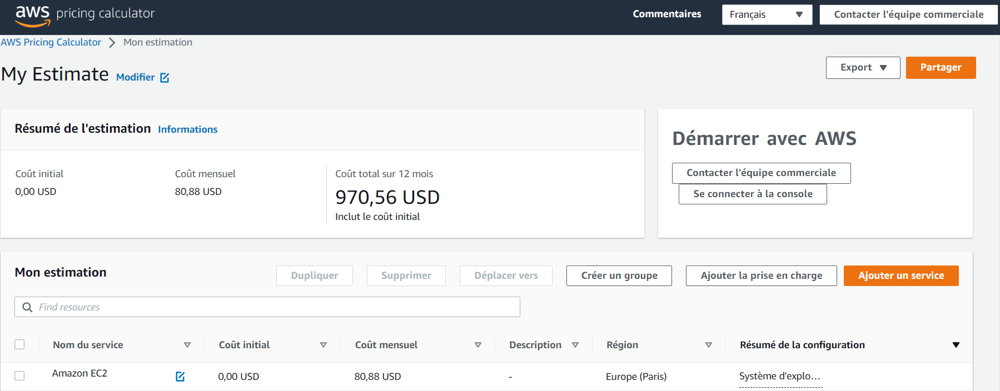

**1 serveur avec les ressources suivantes :**
> 16 Go de RAM minimum
> 4vCPU
> 100 Go de stockage disque

```
Instance : t4g.xlarge (4vCPU, 16Go Mem) = offre moins cher
Amazon EC2 = 69,28 USD/mois
Stockage = 100 Go * 0.116 USD/mois
```

## ***Coût total = 80,88 USD/mois***
