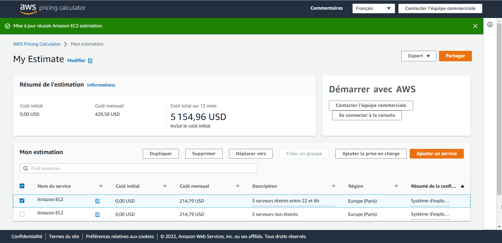

**6 serveurs avec les ressources suivantes :**
> 6 Go de RAM minimum
> 3 vCPU
> 20 Go de stockage disque
>  Les 3 serveurs sont éteints la nuit de 22h à 6h du matin

### 3 serveurs non éteints
```
Instance : t4g.xlarge (4vCPU, 16Go Mem) = offre moins cher
Amazon EC2 = 69.28 * 3 = 207,83 USD
Stockage = 20 Go * 0.116 * 3 = 6,96 USD
*Coût total = 214,79 USD*
```

### 3 serveurs éteints entre 22 et 6h du matin
```
Instance : t4g.xlarge (4vCPU, 16Go Mem) = offre moins cher
Amazon EC2 = 69.28 * 3 = 207,83 USD
Utilisation = 6h -> 22h = 16h
20Go = 0.116 * 3 = 6,96 USD
Coût total = 214,79 USD
```

## ***Coût total = 429.58 USD/mois***

