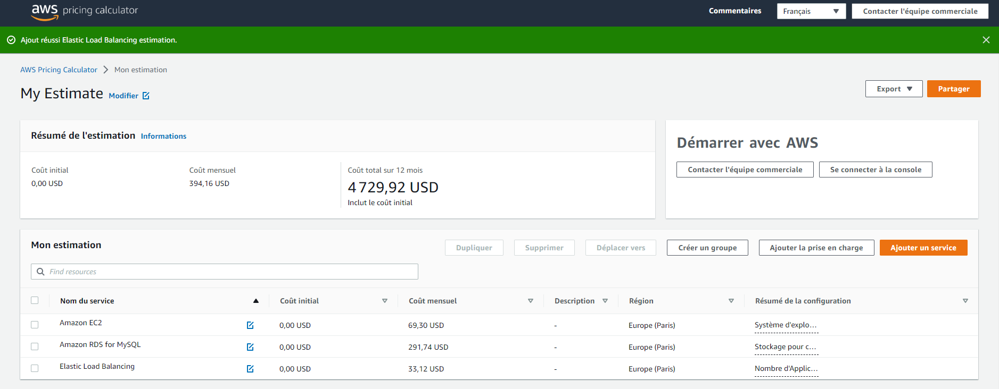

**3 serveurs avec les ressources suivantes :**
> 4 Go de RAM minimum
> 2 vCPU
> 50 Go de stockage disque par serveur

**1 load balancer qui répartit 5 Mb/s de données équitablement vers les 3 serveurs ci-dessus**

**1 service de base de données managé**
> 8 Go de RAM minimum
> 2 vCPU
> 10 Go de stockage disque

### 3 serveurs
```
Instance : t4g.medium (2vCPU, 4Go Mem) = offre moins cher
Amazon EC2 = 17.30 * 3 = 51,90 USD
Stockage = 0.116 * 50 * 3 = 17.40 USD
Coût total = 69,30 USD
```

### 1 load balancer
```
Instance : Elastic Load Balancing (Application Load Balancer)
Octets traités : 2.25Go/heure
1 équilibreur de charge * 2.25 * 0.0084LCU/heure * 730h = 13.80 USD
Application de Load Balancer = 19.32 USD
Coût total = 	33,12 USD
```

### 1 serveur de base de données
```
Amazon RDS for SQL Server = db.m5d.large 2vCPU, 8Go RAM = 289,08 USD
Stockage = 10 Go/mois * 0.266 USD = 2.66 USD
Coût total =	291,74 USD
```

## ***Coût total = 394,16 USD***

